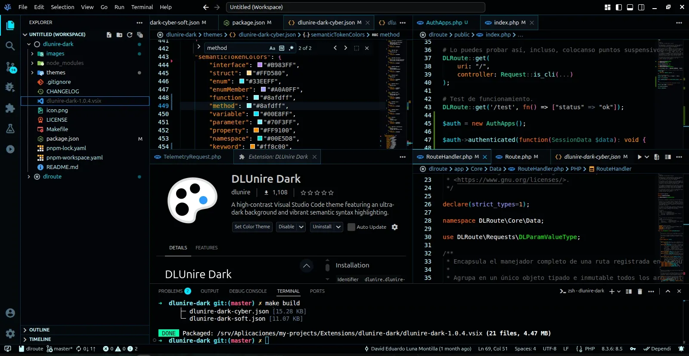
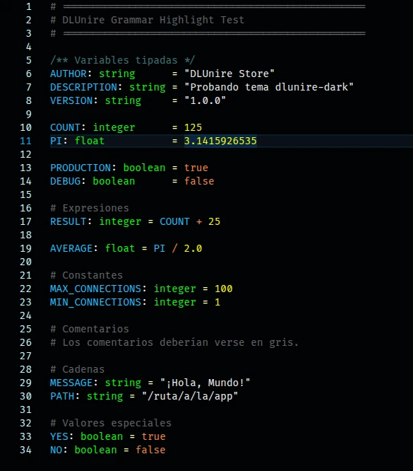
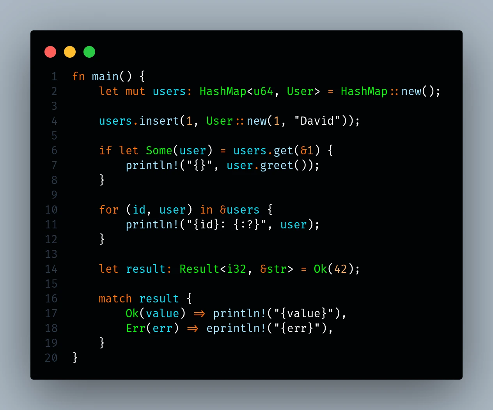
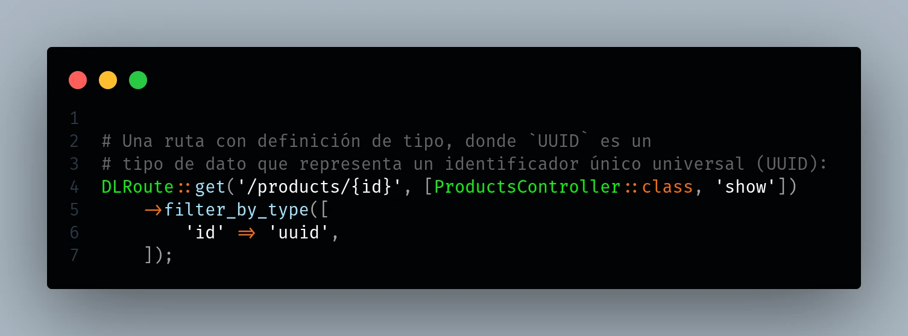

# DLUnire Dark

 **A modern high-contrast color theme suite for Visual Studio Code.** 

<video autoplay loop muted playsinline width="100%" src="https://raw.githubusercontent.com/dlunire/theme-dlunire-dark/master/preview.mp4">
  <source src="https://raw.githubusercontent.com/dlunire/theme-dlunire-dark/master/preview.mp4" type="video/mp4">
  Navegador no soportado
</video>

Preview from `DLUnire Dark` -->

<!-- 

---

[English](#english) | [Español](#español)

---

<a name="english"></a>

## English

DLUnire Dark is built for developers who want a clean, high-contrast editor without giving up semantic consistency.

Instead of coloring tokens at random, the theme groups language constructs by their role in the code. That makes complex codebases easier to scan, understand, and navigate.

It was refined against real projects in the **DLUnire Framework** ecosystem and works well across modern languages — with special care for PHP and TypeScript.

### Syntax types at a glance

A compact grammar sample showing how variables, types, strings, numbers, booleans, and comments are distinguished:



---

### Table of Contents

* [Overview](#overview-en)
* [Theme Variants](#theme-variants-en)
* [Gallery](#gallery-en)
* [Features](#features-en)
* [Color Palette](#color-palette-en)
* [Supported Languages](#supported-languages-en)
* [Installation](#installation-en)
* [Design Philosophy](#design-philosophy-en)
* [Repository](#repository-en)

---

<a name="overview-en"></a>

### Overview

DLUnire Dark follows one simple idea:

> **Source code should communicate structure before syntax.** 

Each construct belongs to a stable visual category. Keywords, types, functions, properties, and comments stay visually distinct, so patterns stand out faster and long sessions feel less tiring.

The theme started with PHP in mind, then was tested extensively with modern frontend stacks and systems languages.

#### Main goals

* Improve readability
* Keep semantic coloring consistent
* Reduce eye strain
* Emphasize constructs that matter
* Keep the UI clean and free of noise

---

<a name="theme-variants-en"></a>

### Theme Variants

Version **1.0.4** expands the suite into four specialized variants tailored for different display setups, lighting environments, and aesthetic preferences:

1. **DLUnire Dark** 
   The original high-contrast theme with an ultra-dark background ( `#010305` ) and crisp semantic highlighting.
2. **DLUnire Dark Soft** 
   Features a slightly softened background ( `#07090b` ) to reduce glare and visual fatigue during late-night coding sessions.
3. **DLUnire Dark Cyber** 
   An electric cybernetic variant built on the `#010305` background. It uses neon cyan ( `#00F5FF` ), vibrant mint ( `#00FFAA` ), and bright accents, featuring sharp token separation for class definitions vs. inherited classes.
4. **DLUnire Dark Cyber Soft** 
   Combines the electric cyber-neon palette with a balanced, softer dark background ( `#04080C` ) for maximum legibility and reduced eye strain.

---

<a name="gallery-en"></a>

### Gallery

The screenshots below come from real projects in the **DLUnire** ecosystem — production code, not toy demos.

#### TypeScript

Core modules, imports, type declarations, functions, and comments.


---

#### Svelte

Components, layouts, embedded TypeScript, and application structure.


---

#### SCSS

Variables, selectors, nested rules, properties, and mixins.


---

#### TypeScript — Routing Engine

A larger TypeScript sample showing routing, modules, and application architecture.


---

#### Rust

Traits, ownership, modules, macros, and modern Rust syntax.



---

#### PHP

Namespaces, classes, methods, attributes, and modern PHP syntax.



---

#### PHP Controller

A production controller built with the DLUnire Framework.


---

<a name="features-en"></a>

### Features

DLUnire Dark uses a semantic color system rather than arbitrary syntax highlighting.

#### Highlights

* Multiple dark backgrounds (Ultra-dark `#010305`, Soft `#07090b`, Cyber `#04080C`)
* High-contrast syntax highlighting
* Balanced, carefully tuned palette
* Precise distinction between class declarations and inherited types
* Comfortable for long coding sessions
* Clear visual identity for:
  + Keywords
  + Classes
  + Inherited Classes
  + Interfaces
  + Traits
  + Enums
  + Functions
  + Methods
  + Variables
  + Properties
  + Attributes
  + Primitive types
  + Constants
  + Numeric literals
  + Comments
* Comments without italics
* Consistent editor chrome
* Minimal visual distractions
* Tuned for modern languages

---

<a name="color-palette-en"></a>

### Color Palette

| Element          |   Color   | Purpose                                    |
| ---------------- | :-------: | ------------------------------------------ |
| Background       | `#010305` | Ultra-dark editor background               |
| Default Text     | `#FFFFFF` | Strings and editor foreground              |
| Keywords         | `#FF6D00` | Flow control and modifiers                 |
| Declarations     | `#00D0FF` | Functions, namespaces, and declarations    |
| Defined Classes  | `#00FFAA` | Active class definitions and namespaces    |
| Inherited Types  | `#00F5FF` | Inherited classes and extended types       |
| Functions        | `#FF7AC6` | Functions and methods                      |
| Variables        | `#00E8FF` | Variables and parameters                   |
| Properties       | `#FF9100` | Object properties                          |
| Attributes       | `#F50057` | Language attributes                        |
| Primitive Types  | `#1DE9B6` | Built-in language types                    |
| HTML/XML Tags    | `#1DE9B6` | HTML/XML elements                          |
| Constants        | `#A0A0FF` | Language constants and booleans            |
| Numbers          | `#FAA859` | Numeric literals                           |
| Comments         | `#656565` | Non-italic comments                        |

---

<a name="supported-languages-en"></a>

### Supported Languages

DLUnire Dark works with every language Visual Studio Code supports. Extra attention went into:

* PHP
* TypeScript
* JavaScript
* Svelte
* Rust
* HTML
* CSS
* SCSS
* JSON
* Markdown

Gallery images were captured from real **DLUnire** projects.

---

<a name="installation-en"></a>

### Installation

#### Visual Studio Code Marketplace

1. Open **Extensions** (`Ctrl + Shift + X`).
2. Search for **DLUnire Dark** .
3. Click **Install** .
4. Open **Preferences → Color Theme** .
5. Select your preferred variant ( **DLUnire Dark**, **Dark Soft**, **Dark Cyber**, or **Dark Cyber Soft** ).

Or install from the terminal:

```bash
code --install-extension dlunire.dlunire-dark
```

---

<a name="design-philosophy-en"></a>

### Design Philosophy

Programming languages are structured systems. A theme should reinforce that structure, not hide it.

DLUnire Dark maps colors to the semantic role of each construct. You spot patterns faster, understand code more easily, and keep a clean, consistent look across languages.

Instead of giving every token equal weight, the theme highlights what defines architecture and behavior.

---

<a name="repository-en"></a>

### Repository

 **Website:** [https://dlunire.dev](https://dlunire.dev)  
 **Source:** [https://github.com/dlunire/theme-dlunire-dark](https://github.com/dlunire/theme-dlunire-dark)

Bug reports, feature requests, and contributions are welcome.

 **License:** MIT · **Publisher:** [dlunire](https://dlunire.dev) · **Version:** 1.0.4

---
---

<a name="español"></a>

## Español

DLUnire Dark está diseñado para desarrolladores que buscan un editor limpio y de alto contraste sin renunciar a la consistencia semántica.

En lugar de colorear tokens al azar, el tema agrupa las construcciones del lenguaje según su rol en el código. Esto facilita el escaneo, comprensión y navegación en bases de código complejas.

Fue perfeccionado en proyectos reales del ecosistema **DLUnire Framework** y funciona de maravilla en lenguajes modernos, con especial cuidado en PHP y TypeScript.

### Tipos de sintaxis de un vistazo

Muestra compacta de gramática que ilustra cómo se distinguen variables, tipos, cadenas, números, booleanos y comentarios:


---

### Tabla de contenidos

* [Descripción general](#descripción-general-es)
* [Variantes del tema](#variantes-del-tema-es)
* [Galería](#galería-es)
* [Características](#características-es)
* [Paleta de colores](#paleta-de-colores-es)
* [Lenguajes soportados](#lenguajes-soportados-es)
* [Instalación](#instalación-es)
* [Filosofía de diseño](#filosofía-de-diseño-es)
* [Repositorio](#repositorio-es)

---

<a name="descripción-general-es"></a>

### Descripción general

DLUnire Dark sigue una idea simple:

> **El código fuente debe comunicar la estructura antes que la sintaxis.** 

Cada construcción pertenece a una categoría visual estable. Las palabras clave, tipos, funciones, propiedades y comentarios se mantienen visualmente distintos, de modo que los patrones se detectan más rápido y las sesiones largas son menos agotadoras.

El tema comenzó pensando en PHP y luego fue probado exhaustivamente con stacks frontend modernos y lenguajes de sistemas.

#### Objetivos principales

* Mejorar la legibilidad
* Mantener consistente el coloreado semántico
* Reducir la fatiga visual
* Destacar las construcciones importantes
* Mantener la interfaz limpia y libre de ruido visual

---

<a name="variantes-del-tema-es"></a>

### Variantes del tema

La versión **1.0.4** expande la suite a cuatro variantes especializadas, adaptadas a diferentes configuraciones de pantalla, entornos de iluminación y preferencias estéticas:

1. **DLUnire Dark** 
   El tema original de alto contraste con fondo ultra oscuro ( `#010305` ) y un resaltado semántico nítido.
2. **DLUnire Dark Soft** 
   Presenta un fondo suave ( `#07090b` ) para reducir el deslumbramiento y la fatiga visual durante sesiones nocturnas de programación.
3. **DLUnire Dark Cyber** 
   Una variante cibernética eléctrica sobre el fondo `#010305` . Utiliza cian neón ( `#00F5FF` ), verde menta vibrante ( `#00FFAA` ) y acentos brillantes, con una separación nítida para definiciones de clases frente a clases heredadas.
4. **DLUnire Dark Cyber Soft** 
   Combina la paleta ciber-neón eléctrica con un fondo oscuro equilibrado ( `#04080C` ) para máxima legibilidad y menor cansancio visual.

---

<a name="galería-es"></a>

### Galería

Las siguientes capturas provienen de proyectos reales en el ecosistema **DLUnire** — código de producción, no demos de juguete.

#### TypeScript

Módulos centrales, importaciones, declaraciones de tipos, funciones y comentarios.


---

#### Svelte

Componentes, layouts, TypeScript embebido y estructura de aplicación.


---

#### SCSS

Variables, selectores, reglas anidadas, propiedades y mixins.


---

#### TypeScript — Motor de enrutamiento

Un ejemplo más amplio de TypeScript que muestra enrutamiento, módulos y arquitectura de aplicación.


---

#### Rust

Traits, propiedad (ownership), módulos, macros y sintaxis moderna de Rust.


---

#### PHP

Namespaces, clases, métodos, atributos y sintaxis moderna de PHP.


---

#### Controlador PHP

Un controlador de producción construido con DLUnire Framework.


---

<a name="características-es"></a>

### Características

DLUnire Dark utiliza un sistema de color semántico en lugar de un resaltado de sintaxis arbitrario.

#### Aspectos destacados

* Múltiples fondos oscuros (Ultra oscuro `#010305`, Suave `#07090b`, Ciber `#04080C`)
* Resaltado sintáctico de alto contraste
* Paleta equilibrada y minuciosamente ajustada
* Distinción precisa entre declaraciones de clases y tipos heredados
* Cómodo para largas jornadas de programación
* Identidad visual clara para:
  + Palabras clave
  + Clases
  + Clases heredadas
  + Interfaces
  + Traits
  + Enums
  + Funciones
  + Métodos
  + Variables
  + Propiedades
  + Atributos
  + Tipos primitivos
  + Constantes
  + Literales numéricos
  + Comentarios
* Comentarios sin cursiva
 * Interfaz del editor (*chrome* ) consistente
* Mínimas distracciones visuales
* Optimizado para lenguajes modernos

---

<a name="paleta-de-colores-es"></a>

### Paleta de colores

| Elemento          |   Color   | Propósito                                    |
| ----------------- | :-------: | -------------------------------------------- |
| Fondo             | `#010305` | Fondo de editor ultra oscuro                 |
| Texto por defecto | `#FFFFFF` | Cadenas de texto y primer plano del editor   |
| Palabras clave    | `#FF6D00` | Control de flujo y modificadores             |
| Declaraciones     | `#00D0FF` | Funciones, namespaces y declaraciones        |
| Clases definidas  | `#00FFAA` | Definiciones activas de clases y namespaces  |
| Tipos heredados   | `#00F5FF` | Clases heredadas y tipos extendidos          |
| Funciones         | `#FF7AC6` | Funciones y métodos                          |
| Variables         | `#00E8FF` | Variables y parámetros                       |
| Propiedades       | `#FF9100` | Propiedades de objetos                       |
| Atributos         | `#F50057` | Atributos del lenguaje                       |
| Tipos primitivos  | `#1DE9B6` | Tipos nativos del lenguaje                   |
| Etiquetas HTML/XML| `#1DE9B6` | Elementos HTML/XML                           |
| Constantes        | `#A0A0FF` | Constantes del lenguaje y booleanos          |
| Números           | `#FAA859` | Literales numéricos                         |
| Comentarios       | `#656565` | Comentarios sin cursiva                      |

---

<a name="lenguajes-soportados-es"></a>

### Lenguajes soportados

DLUnire Dark funciona con todos los lenguajes compatibles con Visual Studio Code. Se puso especial atención en:

* PHP
* TypeScript
* JavaScript
* Svelte
* Rust
* HTML
* CSS
* SCSS
* JSON
* Markdown

Las imágenes de la galería fueron capturadas de proyectos reales de **DLUnire** .

---

<a name="instalación-es"></a>

### Instalación

#### Mercado de extensiones de VS Code

1. Abre **Extensiones** (`Ctrl + Shift + X`).
2. Busca **DLUnire Dark** .
3. Haz clic en **Instalar** .
4. Abre **Preferencias → Tema de color** .
5. Selecciona tu variante preferida ( **DLUnire Dark**, **Dark Soft**, **Dark Cyber** o **Dark Cyber Soft** ).

O instala desde la terminal:

```bash
code --install-extension dlunire.dlunire-dark
```

---

<a name="filosofía-de-diseño-es"></a>

### Filosofía de diseño

Los lenguajes de programación son sistemas estructurados. Un tema debe reforzar esa estructura, no ocultarla.

DLUnire Dark mapea los colores al rol semántico de cada construcción. Detectas patrones más rápido, entiendes el código con mayor facilidad y mantienes una apariencia limpia y consistente en múltiples lenguajes.

En lugar de darle el mismo peso a cada token, el tema destaca aquello que define la arquitectura y el comportamiento.

---

<a name="repositorio-es"></a>

### Repositorio

 **Sitio web:** [https://dlunire.dev](https://dlunire.dev)  
 **Código fuente:** [https://github.com/dlunire/theme-dlunire-dark](https://github.com/dlunire/theme-dlunire-dark)

Reportes de errores, solicitudes de características y contribuciones son bienvenidos.

 **Licencia:** MIT · **Publicador:** [dlunire](https://dlunire.dev) · **Versión:** 1.0.4
