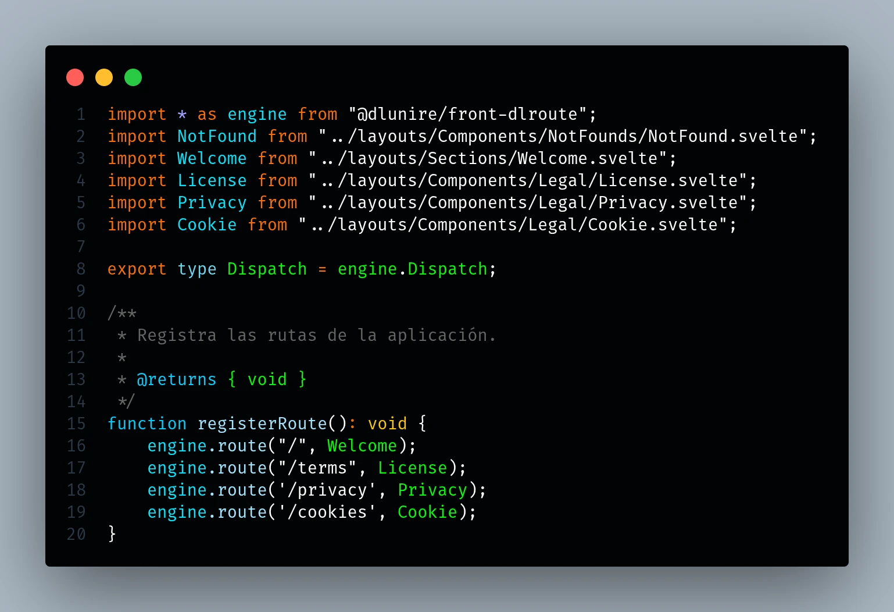
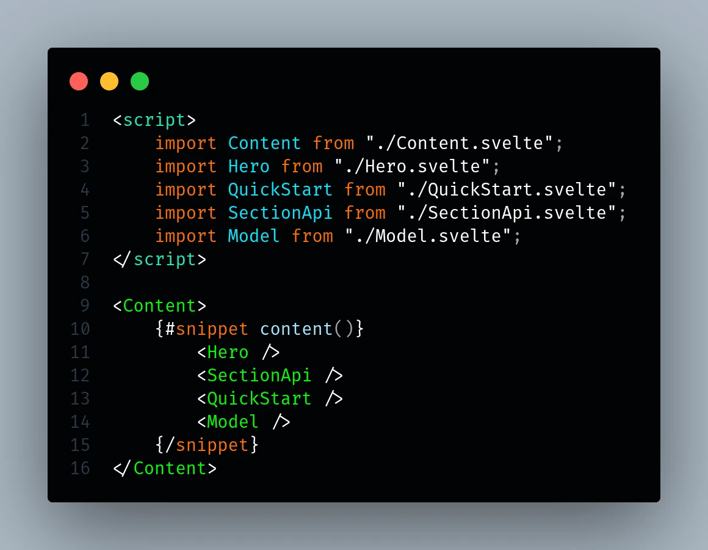
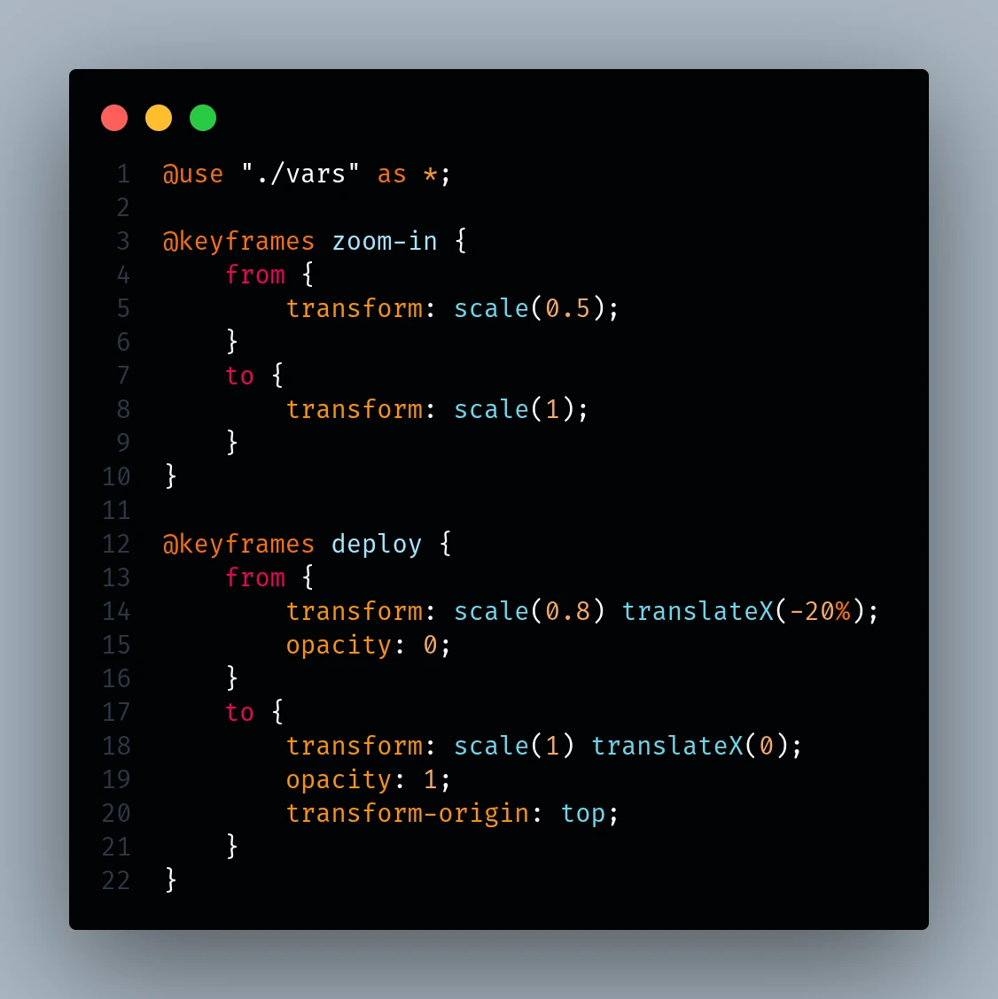
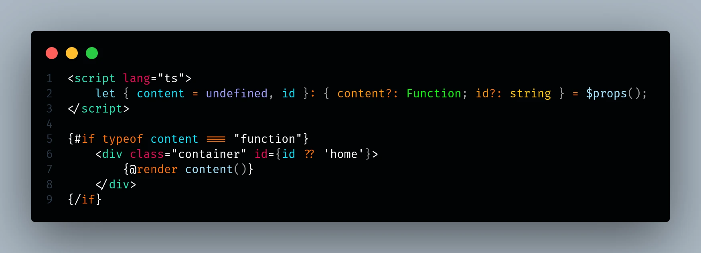

# DLUnire Dark

> A modern high-contrast color theme for Visual Studio Code.



---

> 🇺🇸 **English** | 🇪🇸 **Español**

DLUnire Dark is a modern color theme designed for developers who prefer a clean, high-contrast coding experience without sacrificing semantic consistency.

Instead of assigning colors arbitrarily, the theme groups language constructs according to their role within the source code, making complex codebases easier to read and navigate.

The theme has been carefully tuned using real-world projects developed within the **DLUnire Framework** ecosystem and supports a wide range of modern programming languages.

---

## Table of Contents

- [DLUnire Dark](#dlunire-dark)
  - [Table of Contents](#table-of-contents)
- [🇺🇸 English](#-english)
  - [Overview](#overview)
    - [Main goals](#main-goals)
  - [Gallery](#gallery)
    - [TypeScript](#typescript)
    - [Svelte](#svelte)
    - [SCSS](#scss)
    - [TypeScript — Routing Engine](#typescript--routing-engine)
    - [Rust](#rust)
    - [PHP](#php)
    - [PHP Controller](#php-controller)
  - [Features](#features)
    - [Highlights](#highlights)
  - [Color Palette](#color-palette)
  - [Supported Languages](#supported-languages)
  - [Installation](#installation)
    - [Visual Studio Code Marketplace](#visual-studio-code-marketplace)
  - [Design Philosophy](#design-philosophy)
  - [Repository](#repository)

---

# 🇺🇸 English

## Overview

DLUnire Dark is a high-contrast Visual Studio Code theme designed around a simple principle:

> **Source code should communicate structure before syntax.**

Instead of relying on random color assignments, the theme applies a semantic approach where each language construct belongs to a consistent visual category.

This improves readability, accelerates visual recognition and reduces eye strain during long programming sessions.

The theme was primarily designed for PHP development, although it has been extensively tested with modern frontend and systems programming languages.

### Main goals

- Improve readability.
- Increase semantic consistency.
- Reduce visual fatigue.
- Highlight important language constructs.
- Maintain a clean and distraction-free interface.

---

## Gallery

All screenshots shown below were taken from real-world projects developed within the **DLUnire** ecosystem.

Rather than using artificial examples, every preview demonstrates how the theme behaves in production-quality source code.

### TypeScript

Core modules, imports, type declarations, functions and comments.


---

### Svelte

Components, layouts, embedded TypeScript and application structure.



---

### SCSS

Variables, selectors, nested rules, properties and mixins.



---

### TypeScript — Routing Engine

A larger TypeScript example showcasing routing, modules and application architecture.



---

### Rust

Traits, ownership, modules, macros and modern Rust syntax.


---

### PHP

Namespaces, classes, methods, attributes and modern PHP syntax.


---

### PHP Controller

A production-ready controller built using the DLUnire Framework.


---

## Features

DLUnire Dark has been designed with a semantic color system instead of arbitrary syntax coloring.

### Highlights

- Ultra-dark background (`#010305`)
- High-contrast syntax highlighting
- Carefully balanced color palette
- Semantic syntax classification
- Optimized for long development sessions
- Distinct visual identities for:
  - Keywords
  - Classes
  - Interfaces
  - Traits
  - Enums
  - Functions
  - Methods
  - Variables
  - Properties
  - Attributes
  - Primitive types
  - Constants
  - Numeric literals
  - Comments
- Comments without italics
- Consistent editor interface
- Minimal visual distractions
- Designed for modern programming languages

---

## Color Palette

| Element         |   Color   | Purpose                                    |
| --------------- | :-------: | ------------------------------------------ |
| Background      | `#010305` | Ultra-dark editor background               |
| Default Text    | `#FFFFFF` | Strings and editor foreground              |
| Keywords        | `#FF6D00` | Flow control and modifiers                 |
| Declarations    | `#00D0FF` | Functions, namespaces and declarations     |
| Classes         | `#00FF00` | Classes, interfaces, traits and namespaces |
| Functions       | `#A0E5FF` | Functions and methods                      |
| Variables       | `#00E8FF` | Variables and parameters                   |
| Properties      | `#FF9100` | Object properties                          |
| Attributes      | `#F50057` | Language attributes                        |
| Primitive Types | `#FFC600` | Built-in language types                    |
| HTML/XML Tags   | `#1DE9B6` | HTML/XML elements                          |
| Constants       | `#A0A0FF` | Language constants and booleans            |
| Numbers         | `#FAA859` | Numeric literals                           |
| Comments        | `#656565` | Non-italic comments                        |

---

## Supported Languages

Although DLUnire Dark works with every language supported by Visual Studio Code, special attention has been given to the following technologies:

- PHP
- TypeScript
- JavaScript
- Svelte
- Rust
- HTML
- CSS
- SCSS
- JSON
- Markdown

The screenshots presented in this README were captured from real projects developed within the **DLUnire** ecosystem.

---

## Installation

### Visual Studio Code Marketplace

1. Open **Extensions** (`Ctrl + Shift + X`).
2. Search for **DLUnire Dark**.
3. Click **Install**.
4. Open **Preferences → Color Theme**.
5. Select **DLUnire Dark**.

Or install directly from the terminal:

```bash
code --install-extension dlunire.dlunire-dark
```

---

## Design Philosophy

Programming languages are structured systems.

A color theme should reinforce that structure rather than obscure it.

DLUnire Dark classifies syntax according to the semantic role each construct plays within the language. This allows developers to recognize patterns more quickly, improving code comprehension while maintaining a clean and consistent visual experience.

Rather than emphasizing every token equally, the theme focuses attention on language constructs that define the architecture and behavior of the source code.

---

## Repository

Project website

https://dlunire.dev

Source code

https://github.com/dlunire/theme-dlunire-dark

Bug reports, feature requests and contributions are welcome.

---
